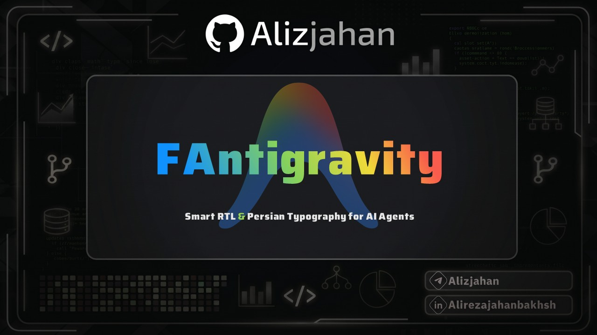

<p align="center">
  
</p>

<div align="center">

# FAntigravity
### Smart RTL & Persian Typography Engine for Antigravity (Standalone App)

[](https://github.com/Alizjahan/FAntigravity)
[](https://opensource.org/licenses/MIT)
[](https://nodejs.org/)
[]()
[](https://github.com/Alizjahan)

Read and write naturally in Persian, Arabic, and Hebrew inside Google Antigravity Desktop, without breaking code blocks, terminal sessions, or English text.

[Overview](#overview) | [Features](#features) | [Installation](#installation) | [CLI Reference](#cli-reference) | [Shortcuts](#keyboard-shortcuts) | [Architecture](#how-it-works) | [Uninstallation](#uninstallation) | [Antigravity IDE Note](#antigravity-ide-edition) | [راهنمای فارسی](#راهنمای-فارسی)

</div>

---

## Overview

FAntigravity is a non-invasive right-to-left (RTL) injection engine and typography system tailored specifically for the official **Google Antigravity Standalone Desktop Application** (Electron).

By analyzing text streams in real time using Unicode-aware heuristics, it dynamically isolates Persian and Arabic sentences while keeping code snippets, backtick literals, terminal buffers, and prompt templates strictly Left-to-Right (LTR).

---

## Features

- **Automated Standalone Application Detection**: Recursively locates the official Antigravity desktop installation across standard operating system directories on Windows, macOS, and Linux.
- **Smart Bi-Directional Isolation**: Inspects incoming tokens and isolates direction per paragraph, preventing mixed-script punctuation and bracket inversions.
- **Strict Code & Terminal Preservation**: Blocks within `<pre>`, `<code>`, Monaco editor widgets, diff views, and command outputs remain intact in LTR.
- **Offline Typography Engine**:
  - Embedded **Vazirmatn Variable** font (zero-network base64 format).
  - Embedded **Snapp Web** font for alternative contemporary Persian typography.
  - Runtime support for any locally installed system font (e.g., IRANSans, B Nazanin, Tahoma).
  - Independent font assignment for Persian, English, and Monospace code blocks.
  - Real-time sliders for live line-height and font-size scaling with instant reset capability.
- **Tri-State Theme System**:
  - Light Theme (High-contrast day layout)
  - Dark Theme (Deep charcoal low-luminance palette)
  - Antigravity Star Theme (Multi-stop aurora cyan/blue palette)
- **Persian Keyboard Symbol Fix**: Corrects the Persian keyboard mapping where `Shift + 2` incorrectly outputs `٬` instead of `@`.
- **Zero Network Telemetry**: Completely self-contained; makes no external calls, tracks no metrics, and runs strictly within local process boundaries.
- **Atomic Backup Protection**: Creates byte-level `.bak` snapshots prior to any package manipulation, enabling instant single-command restoration.

---

## Antigravity IDE Edition

This repository is dedicated solely to the **Antigravity Standalone Desktop App**.

If you are using **Antigravity IDE** (the VS Code fork), an official Open VSX / VS Code extension is currently being prepared for installation directly through the IDE Extensions Marketplace without modifying binary archives.

---

## Installation

Node.js **20 or newer** is required.

### Quick Start via NPX

Execute the following command in your terminal:

```bash
npx -y -p github:Alizjahan/FAntigravity fantigravity
```

#### Platform-specific execution notes:
- **Windows**: Run in PowerShell or Command Prompt.
- **macOS**: Run in Terminal.
- **Linux**: Run with appropriate permissions (e.g., `sudo` if installed in system directories).

---

### Manual Installation from Source

```bash
git clone https://github.com/Alizjahan/FAntigravity.git
cd FAntigravity
npm install
node bin/index.js
```

---

## CLI Reference

| Command | Action |
| :--- | :--- |
| `npx -y -p github:Alizjahan/FAntigravity fantigravity` | Scans for Antigravity Standalone App and applies the RTL patch |
| `npx -y -p github:Alizjahan/FAntigravity fantigravity --restore` | Reverts all patches and restores the original backup archive |
| `npx -y -p github:Alizjahan/FAntigravity fantigravity --path "<path>"` | Specifies a custom file path to `app.asar` directly |
| `npx -y -p github:Alizjahan/FAntigravity fantigravity --help` | Displays help message and available CLI arguments |

---

## Keyboard Shortcuts

| Shortcut | Scope | Action |
| :--- | :--- | :--- |
| `Alt + R` | Windows / Linux | Toggle FAntigravity Settings Dropdown |
| `Option + R` | macOS | Toggle FAntigravity Settings Dropdown |
| `Shift + 2` | Global (Persian Layout) | Outputs `@` character directly when `@ Fix` is active |

---

## How It Works

1. **Target Identification**: Resolves the Antigravity desktop installation path and verifies `app.asar`.
2. **Integrity Validation**: Verifies write permissions and generates an intact `app.asar.bak` replica before altering any archive.
3. **Engine Injection**: Unpacks `app.asar`, injects the `payload.js` engine into `dist/utils.js`, bundles required typography assets, and safely repacks the package.
4. **Asset Inlining**: Bundles pre-compiled WOFF2 fonts directly into the package structure, eliminating CDN latency and offline failures.
5. **Configuration Persistence**: Stores user preferences in `~/.faliz-rtl.json` and synchronizes them across application restarts.

---

## Uninstallation

To remove all injected modifications and restore the original Antigravity binaries:

```bash
npx -y -p github:Alizjahan/FAntigravity fantigravity --restore
```

---

<div dir="rtl">

## راهنمای فارسی

ابزار FAntigravity جهت فراهم‌سازی پشتیبانی پیشرفته از زبان فارسی، چیدمان راست‌به‌چپ (RTL) و شخصی‌سازی فونت به صورت اختصاصی برای نرم‌افزار مستقل Google Antigravity توسعه یافته است.

### قابلیت‌های اصلی

- **پشتیبانی اختصاصی از نسخه دسکتاپ**: شناسایی خودکار فایل‌های برنامه مستقل Antigravity در ویندوز، مک و لینوکس.
- **تشخیص هوشمند جهت متن**: تنظیم خودکار جهت جملات فارسی به راست‌چین و انگلیسی به چپ‌چین بدون تداخل در علائم نگارشی و پرانتزها.
- **حفظ ساختار کدها و ترمینال**: محیط‌های ویرایش کد، بلوک‌های کد (`pre` و `code`) و پنجره ترمینال کاملاً در حالت استاندارد چپ‌چین (LTR) باقی می‌مانند.
- **مدیریت تایپوگرافی آفلاین**:
  - فونت متغیر وزیرمتن (Vazirmatn Variable) به صورت آفلاین و تعبیه‌شده.
  - فونت اسنپ (Snapp Web) برای نگارش امروزی.
  - امکان تعریف هر نوع فونت نصب‌شده در سیستم‌عامل (نظیر ایران‌یکان، بی نازنین و غیره).
  - تنظیم بلادرنگ اندازه فونت و فاصله خطوط به همراه دکمه بازنشانی.
- **سیستم سه‌گانه تم**:
  - تم روشن (Light)
  - تم تاریک (Dark)
  - تم ستاره آنتی‌گرویتی (Antigravity Star)
- **اصلاح کلید `@` در صفحه کلید فارسی**: تبدیل خودکار `Shift + 2` به علامت `@` به جای کامای فارسی.
- **کلید میانبر**: دسترسی سریع به منوی تنظیمات با فشردن کلیدهای `Alt + R` در ویندوز و لینوکس یا `Option + R` در مکینتاش.
- **پشتیبان‌گیری خودکار**: تهیه نسخه پشتیبان پیش از هرگونه تغییر جهت بازگردانی آنی برنامه با یک دستور.

### توجه در خصوص Antigravity IDE

این مخزن به صورت اختصاصی برای اپلیکیشن مستقل Antigravity است. برای نسخه Antigravity IDE (مبتنی بر VS Code)، یک اکستنشن رسمی جداگانه برای نصب مستقیم از مخزن افزونه‌ها در حال آماده‌سازی است.

### نحوه نصب

در ترمینال یا پاورشل:

```bash
npx -y -p github:Alizjahan/FAntigravity fantigravity
```

### بازگردانی به نسخه اولیه

```bash
npx -y -p github:Alizjahan/FAntigravity fantigravity --restore
```

</div>

---

## Maintainer & Author

Developed by **Aliz ([@Alizjahan](https://github.com/Alizjahan))**

- GitHub: [https://github.com/Alizjahan](https://github.com/Alizjahan)
- Telegram: [@Alizjahan](https://t.me/Alizjahan)

---

## License

This project is licensed under the [MIT License](LICENSE).
